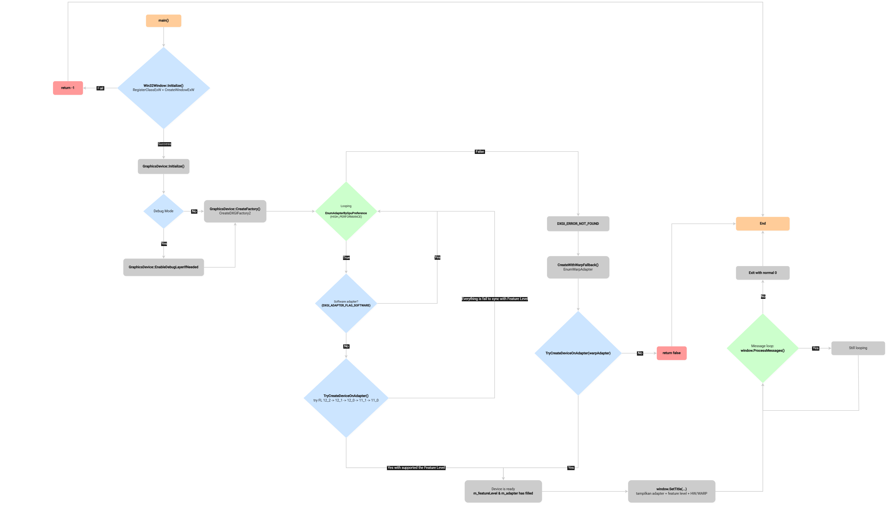
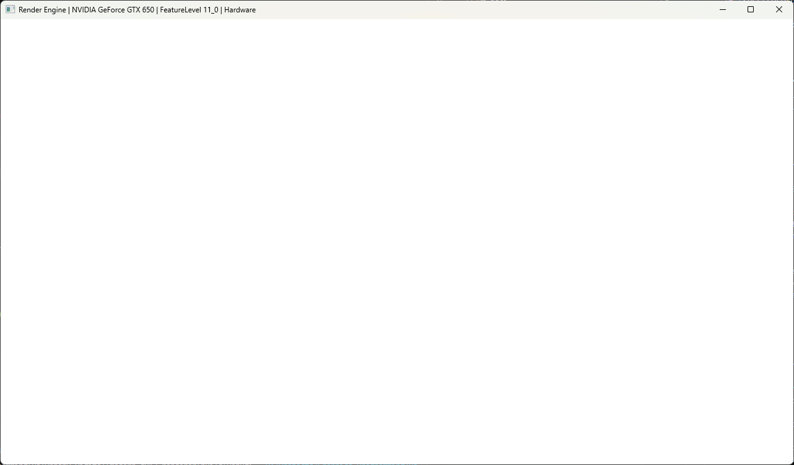
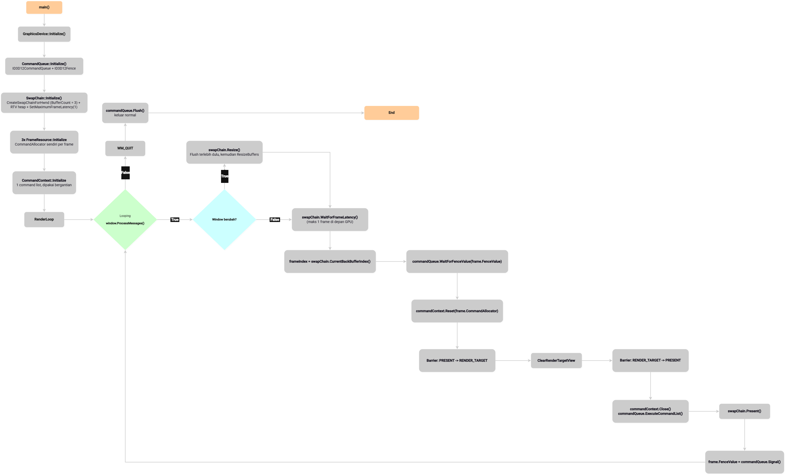
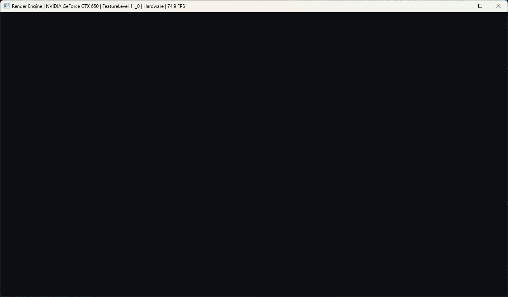
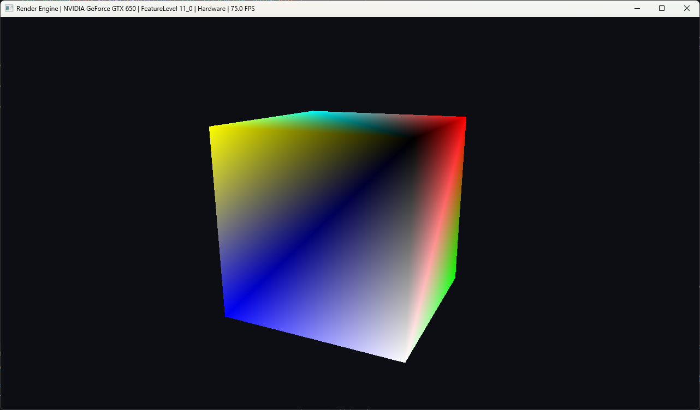

# Modern DirectX 12 Render Engine

Sebuah project minimalis mesin render

## Tech Stack

| Komponen | Pilihan |
|---|---|
| Languange | C++20 (`.hpp`/`.cpp`) |
| Graphics API | DirectX 12 (Agility SDK, Feature Level target `12_2`, minimum `11_0`) |
| Build system | CMake ≥ 4.3 (`FetchContent`, tanpa vcpkg) |
| Compiler | MSVC (Visual Studio 2026 Build Tools) |
| OS target | Windows 11 |
| Windowing | Win32 native |

## Version 0.0.1
- Windowing tanpa swapchain

**Referensi:**
- Buku Frank Luna (Introduction Game Programming DX12 Second Edition): `d3d12book_2ed`, `Common/d3dUtil.h`, `ThrowIfFailed`
- Microsoft Sample: `D3D12HelloWorld`, `GetHardwareAdapter`, skip software adapter, iterasi melalui `EnumAdapterByGpuPreference`
- Microsoft Learn: `D3D12CreteDevice`, `CheckFeatureSupport`, `EnumWarpAdapter`

**Flow**


**Screenshot**


## Version 0.0.2
- Windowing dengan implementasi Swapchain
- Implementasi triple buffering
- Clear screen

**Referensi**
- Buku Frank Luna (Introduction Game Programming DX12 Second Edition): Chapter 4 Dasar pola command queue, command list, fence dan renderloop
- Microsoft Sample: `FrameResource`, `D3D12HelloFrameBuffering` command allocator per-frame, bukan dibagi
- Microsoft Learn: `IDXGISwapChain2::SetMaximumFrameLatency`, `GetFrameLatencyWaitableObject`, `IDXGIFactory2::CreateSwapChainForHwnd`

**Flow**


**Screenshot**


## Version 0.0.3
- Root Signature
- Pipeline State Object
- Cube Rendering

**Referensi**
- Buku Frank Luna (Introduction Game Programming DX12 Second Edition): Chapter 6 dan 7 Root Signature, PSO, Geometri kubus
- Microsoft Sample: `D3D12_INPUT_ELEMENT_DESC`, `D3D12_GRAPHICS_PIPELINE_STATE_DESC`
- Microsoft Learn: `microsoft/DirectX-Headers`, `<directx/d3dx12.h>`, `D3D12SerializeRootSignature`, `D3D12_FEATURE_DATA_SHADER_MODEL`.

**Screenshot**


**Build dan Run**
```bash
cmake --preset windows-msvc

cmake --build build --config Debug

./build/Debug/App.exe
```

# Modern DirectX 12 Render Engine (English)

A minimal rendering engine project built with modern DirectX 12.

## Tech Stack

| Component | Selection |
|-----------|-----------|
| Language | C++20 (`.hpp` / `.cpp`) |
| Graphics API | DirectX 12 (Agility SDK, target Feature Level `12_2`, minimum `11_0`) |
| Build System | CMake ≥ 4.3 (`FetchContent`, no vcpkg) |
| Compiler | MSVC (Visual Studio 2026 Build Tools) |
| Target OS | Windows 11 |
| Windowing | Native Win32 |

## Version 0.0.1

- Win32 window creation without a swap chain.

## References

- Frank Luna, *Introduction to 3D Game Programming with DirectX 12 (2nd Edition)*
  - `Common/d3dUtil.h`
  - `ThrowIfFailed`
- Microsoft Sample: **D3D12HelloWorld**
  - `GetHardwareAdapter`
  - Skip software adapters
  - Enumerate adapters using `EnumAdapterByGpuPreference`
- Microsoft Learn
  - `D3D12CreateDevice`
  - `CheckFeatureSupport`
  - `EnumWarpAdapter`

## Build and Run

```bash
cmake --preset windows-msvc

cmake --build build --config Debug

./build/Debug/App.exe
```

# Modern DirectX 12 Render Engine (日本語版)

モダンな DirectX 12 を用いて構築する、最小構成のレンダリングエンジンプロジェクトです。

## 技術スタック

| 項目 | 採用技術 |
|------|----------|
| プログラミング言語 | C++20 (`.hpp` / `.cpp`) |
| グラフィックス API | DirectX 12（Agility SDK、目標 Feature Level `12_2`、最低 `11_0`） |
| ビルドシステム | CMake 4.3 以上（`FetchContent`、vcpkg 非使用） |
| コンパイラ | MSVC（Visual Studio 2026 Build Tools） |
| 対応 OS | Windows 11 |
| ウィンドウシステム | ネイティブ Win32 |

## Version 0.0.1

- スワップチェーンを使用しない Win32 ウィンドウの生成。

## 参考資料

- Frank Luna
  - *Introduction to 3D Game Programming with DirectX 12 (2nd Edition)*
  - `Common/d3dUtil.h`
  - `ThrowIfFailed`
- Microsoft サンプル: **D3D12HelloWorld**
  - `GetHardwareAdapter`
  - ソフトウェアアダプターを除外
  - `EnumAdapterByGpuPreference` によるアダプター列挙
- Microsoft Learn
  - `D3D12CreateDevice`
  - `CheckFeatureSupport`
  - `EnumWarpAdapter`

## ビルドと実行

```bash
cmake --preset windows-msvc

cmake --build build --config Debug

./build/Debug/App.exe
```

# Modern DirectX 12 Render Engine (Deutsch)

Ein minimalistisches Rendering-Engine-Projekt auf Basis von modernem DirectX 12.

## Technologie-Stack

| Komponente | Auswahl |
|------------|----------|
| Programmiersprache | C++20 (`.hpp` / `.cpp`) |
| Grafik-API | DirectX 12 (Agility SDK, Ziel: Feature Level `12_2`, mindestens `11_0`) |
| Build-System | CMake ≥ 4.3 (`FetchContent`, ohne vcpkg) |
| Compiler | MSVC (Visual Studio 2026 Build Tools) |
| Zielbetriebssystem | Windows 11 |
| Fenstersystem | Natives Win32 |

## Version 0.0.1

- Erstellung eines Win32-Fensters ohne Swap Chain.

## Referenzen

- Frank Luna
  - *Introduction to 3D Game Programming with DirectX 12 (2nd Edition)*
  - `Common/d3dUtil.h`
  - `ThrowIfFailed`
- Microsoft-Beispiel: **D3D12HelloWorld**
  - `GetHardwareAdapter`
  - Softwareadapter überspringen
  - Adapter mit `EnumAdapterByGpuPreference` enumerieren
- Microsoft Learn
  - `D3D12CreateDevice`
  - `CheckFeatureSupport`
  - `EnumWarpAdapter`

## Erstellen und Ausführen

```bash
cmake --preset windows-msvc

cmake --build build --config Debug

./build/Debug/App.exe
```