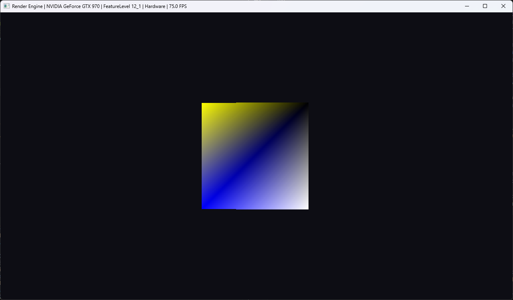
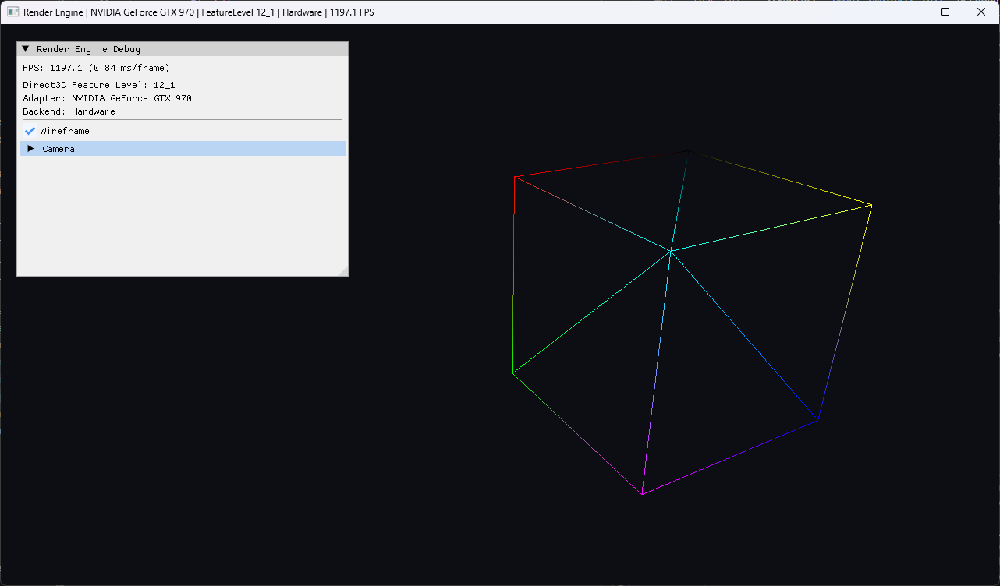

# Modern DirectX 12 Render Engine (Indonesia)

Sebuah project minimalis mesin render

## Tech Stack

| Komponen | Pilihan |
|---|---|
| Languange | C++20 (`.hpp`/`.cpp`) |
| Graphics API | DirectX 12 (Agility SDK, Feature Level target `12_2`, minimum `11_0`) |
| Build system | CMake >= 4.3 (`FetchContent`, tanpa vcpkg) |
| Compiler | MSVC (Visual Studio 2026 Build Tools) |
| Math | DirectXMath |
| Shader | HLSL >= 6.0 (DirectX Shader Compiler (DXC)) |
| Editor Debug | ImGui |
| OS target | Windows 11 |
| Windowing | Win32 native |

## Version 0.0.1
- Windowing tanpa swapchain

**Referensi:**
- Buku Frank Luna (Introduction Game Programming DX12 Second Edition): `d3d12book_2ed`, `Common/d3dUtil.h`, `ThrowIfFailed`
- Microsoft Sample: `D3D12HelloWorld`, `GetHardwareAdapter`, skip software adapter, iterasi melalui `EnumAdapterByGpuPreference`
- Microsoft Learn: `D3D12CreteDevice`, `CheckFeatureSupport`, `EnumWarpAdapter`

**Flow**


**Screenshot**


## Version 0.0.2
- Windowing dengan implementasi Swapchain
- Implementasi triple buffering
- Clear screen

**Referensi**
- Buku Frank Luna (Introduction Game Programming DX12 Second Edition): Chapter 4 Dasar pola command queue, command list, fence dan renderloop
- Microsoft Sample: `FrameResource`, `D3D12HelloFrameBuffering` command allocator per-frame, bukan dibagi
- Microsoft Learn: `IDXGISwapChain2::SetMaximumFrameLatency`, `GetFrameLatencyWaitableObject`, `IDXGIFactory2::CreateSwapChainForHwnd`

**Flow**


**Screenshot**


## Version 0.0.3
- Root Signature
- Pipeline State Object
- Cube Rendering

**Referensi**
- Buku Frank Luna (Introduction Game Programming DX12 Second Edition): Chapter 6 dan 7 Root Signature, PSO, Geometri kubus
- Microsoft Sample: `D3D12_INPUT_ELEMENT_DESC`, `D3D12_GRAPHICS_PIPELINE_STATE_DESC`
- Microsoft Learn: `microsoft/DirectX-Headers`, `<directx/d3dx12.h>`, `D3D12SerializeRootSignature`, `D3D12_FEATURE_DATA_SHADER_MODEL`.

**Screenshot**


## Version 0.0.4
- Camera system minimalist
- Input system
- Time system

**Referensi**
- Buku Frank Luna (Introduction Game Programming DX12 Second Edition): `Common/Camera.h`/`Common/GameTimer.h`
- Kontrol kamera editor Unity (RMB, WASD, Mouselook, Q/E, Shift)

**Screenshot**


## Version 0.0.5
- ImGui UI system
- PSO kedua khusus wireframe render, aktif ketika checkbox enabled
- Debug ui untuk damping dan force strength camera

**Referensi**
- `examples/example_win32_directx12/main.cpp` (repo resmi `ocornut/imgui`) pola `ExampleDescriptorHeapAllocator`, urutan inisialisasi Init/NewFrame/Render/Shutdown, pola `if (ImGui_ImplWin32_WndProcHandler(...)) return true;` di WndProc

**Screenshot**


**Build dan Run**
```bash
cmake --preset windows-msvc

cmake --build build --config Debug

./build/Debug/App.exe
```

# Modern DirectX 12 Render Engine (English)

A minimalist rendering engine project.

## Tech Stack

| Component | Selection |
|---|---|
| Language | C++20 (`.hpp`/`.cpp`) |
| Graphics API | DirectX 12 (Agility SDK, target Feature Level `12_2`, minimum `11_0`) |
| Build System | CMake >= 4.3 (`FetchContent`, no vcpkg) |
| Compiler | MSVC (Visual Studio 2026 Build Tools) |
| Math | DirectXMath |
| Shader | HLSL >= 6.0 (DirectX Shader Compiler (DXC)) |
| Debug UI | ImGui |
| Target OS | Windows 11 |
| Windowing | Native Win32 |

## Version 0.0.1

- Window creation without a swap chain

**References**
- Frank Luna, *Introduction to 3D Game Programming with DirectX 12 (Second Edition)*: `d3d12book_2ed`, `Common/d3dUtil.h`, `ThrowIfFailed`
- Microsoft Sample: `D3D12HelloWorld`, `GetHardwareAdapter`, skip software adapters, iterate using `EnumAdapterByGpuPreference`
- Microsoft Learn: `D3D12CreateDevice`, `CheckFeatureSupport`, `EnumWarpAdapter`

**Flow**


**Screenshot**


## Version 0.0.2

- Windowing with swap chain implementation
- Triple buffering
- Clear screen

**References**
- Frank Luna, *Introduction to 3D Game Programming with DirectX 12 (Second Edition)*: Chapter 4, command queue, command list, fence, and render loop fundamentals
- Microsoft Sample: `FrameResource`, `D3D12HelloFrameBuffering`, per-frame command allocator instead of a shared allocator
- Microsoft Learn: `IDXGISwapChain2::SetMaximumFrameLatency`, `GetFrameLatencyWaitableObject`, `IDXGIFactory2::CreateSwapChainForHwnd`

**Flow**


**Screenshot**


## Version 0.0.3

- Root Signature
- Pipeline State Object (PSO)
- Cube rendering

**References**
- Frank Luna, *Introduction to 3D Game Programming with DirectX 12 (Second Edition)*: Chapters 6–7, Root Signature, PSO, cube geometry
- Microsoft Sample: `D3D12_INPUT_ELEMENT_DESC`, `D3D12_GRAPHICS_PIPELINE_STATE_DESC`
- Microsoft Learn: `microsoft/DirectX-Headers`, `<directx/d3dx12.h>`, `D3D12SerializeRootSignature`, `D3D12_FEATURE_DATA_SHADER_MODEL`

**Screenshot**


## Version 0.0.4

- Minimal camera system
- Input system
- Time system

**References**
- Frank Luna, *Introduction to 3D Game Programming with DirectX 12 (Second Edition)*: `Common/Camera.h`, `Common/GameTimer.h`
- Unity Editor camera controls (RMB, WASD, Mouse Look, Q/E, Shift)

**Screenshot**


## Version 0.0.5

- ImGui UI system
- Secondary PSO dedicated to wireframe rendering, enabled via checkbox
- Debug UI for camera damping and force strength parameters

**References**
- Official `ocornut/imgui` repository: `examples/example_win32_directx12/main.cpp`, `ExampleDescriptorHeapAllocator`, initialization order (Init/NewFrame/Render/Shutdown), and `if (ImGui_ImplWin32_WndProcHandler(...)) return true;` pattern in `WndProc`

**Screenshot**


## Build and Run

```bash
cmake --preset windows-msvc

cmake --build build --config Debug

./build/Debug/App.exe
```

# Modern DirectX 12 Render Engine (Japan)

ミニマルなレンダリングエンジンプロジェクト。

## 技術スタック

| コンポーネント | 採用技術 |
|---|---|
| 言語 | C++20 (`.hpp`/`.cpp`) |
| Graphics API | DirectX 12（Agility SDK、ターゲット Feature Level `12_2`、最低 `11_0`） |
| ビルドシステム | CMake >= 4.3（`FetchContent`、vcpkg 不使用） |
| コンパイラ | MSVC（Visual Studio 2026 Build Tools） |
| 数学ライブラリ | DirectXMath |
| シェーダー | HLSL >= 6.0（DirectX Shader Compiler (DXC)） |
| デバッグ UI | ImGui |
| 対象 OS | Windows 11 |
| ウィンドウシステム | ネイティブ Win32 |

## Version 0.0.1

- スワップチェーンを使用しないウィンドウ生成

**参考資料**
- Frank Luna『Introduction to 3D Game Programming with DirectX 12 (Second Edition)』: `d3d12book_2ed`, `Common/d3dUtil.h`, `ThrowIfFailed`
- Microsoft Sample: `D3D12HelloWorld`, `GetHardwareAdapter`、ソフトウェアアダプターをスキップし、`EnumAdapterByGpuPreference` による列挙
- Microsoft Learn: `D3D12CreateDevice`, `CheckFeatureSupport`, `EnumWarpAdapter`

**Flow**


**Screenshot**


## Version 0.0.2

- スワップチェーンの実装
- トリプルバッファリング
- 画面クリア

**参考資料**
- Frank Luna: Chapter 4（Command Queue、Command List、Fence、および Render Loop の基礎）
- Microsoft Sample: `FrameResource`, `D3D12HelloFrameBuffering`（フレームごとの Command Allocator）
- Microsoft Learn: `IDXGISwapChain2::SetMaximumFrameLatency`, `GetFrameLatencyWaitableObject`, `IDXGIFactory2::CreateSwapChainForHwnd`

**Flow**


**Screenshot**


## Version 0.0.3

- Root Signature
- Pipeline State Object (PSO)
- キューブ描画

**参考資料**
- Frank Luna: Chapter 6–7（Root Signature、PSO、キューブジオメトリ）
- Microsoft Sample: `D3D12_INPUT_ELEMENT_DESC`, `D3D12_GRAPHICS_PIPELINE_STATE_DESC`
- Microsoft Learn: `microsoft/DirectX-Headers`, `<directx/d3dx12.h>`, `D3D12SerializeRootSignature`, `D3D12_FEATURE_DATA_SHADER_MODEL`

**Screenshot**


## Version 0.0.4

- シンプルなカメラシステム
- 入力システム
- 時間管理システム

**参考資料**
- Frank Luna: `Common/Camera.h`, `Common/GameTimer.h`
- Unity Editor カメラ操作（RMB、WASD、Mouse Look、Q/E、Shift）

**Screenshot**


## Version 0.0.5

- ImGui UI システム
- ワイヤーフレーム描画専用の第2 PSO（チェックボックスで切り替え）
- カメラの Damping および Force Strength を調整するデバッグ UI

**参考資料**
- `ocornut/imgui` 公式リポジトリ: `examples/example_win32_directx12/main.cpp`、`ExampleDescriptorHeapAllocator`、Init/NewFrame/Render/Shutdown の初期化手順、`WndProc` における `ImGui_ImplWin32_WndProcHandler` の使用パターン

**Screenshot**


## Build & Run

```bash
cmake --preset windows-msvc

cmake --build build --config Debug

./build/Debug/App.exe
```

# Modern DirectX 12 Render Engine (Deutsch)

Ein minimalistisches Rendering-Engine-Projekt.

## Technologie-Stack

| Komponente | Auswahl |
|---|---|
| Programmiersprache | C++20 (`.hpp`/`.cpp`) |
| Graphics API | DirectX 12 (Agility SDK, Ziel-Feature-Level `12_2`, Mindestanforderung `11_0`) |
| Build-System | CMake >= 4.3 (`FetchContent`, ohne vcpkg) |
| Compiler | MSVC (Visual Studio 2026 Build Tools) |
| Mathematik | DirectXMath |
| Shader | HLSL >= 6.0 (DirectX Shader Compiler (DXC)) |
| Debug-UI | ImGui |
| Zielbetriebssystem | Windows 11 |
| Fenstersystem | Native Win32 |

## Version 0.0.1

- Fenstererstellung ohne Swap Chain

**Referenzen**
- Frank Luna, *Introduction to 3D Game Programming with DirectX 12 (Second Edition)*: `d3d12book_2ed`, `Common/d3dUtil.h`, `ThrowIfFailed`
- Microsoft Sample: `D3D12HelloWorld`, `GetHardwareAdapter`, Software-Adapter überspringen, Iteration über `EnumAdapterByGpuPreference`
- Microsoft Learn: `D3D12CreateDevice`, `CheckFeatureSupport`, `EnumWarpAdapter`

**Flow**


**Screenshot**


## Version 0.0.2

- Fensterverwaltung mit Swap-Chain-Implementierung
- Triple Buffering
- Bildschirm löschen (Clear Screen)

**Referenzen**
- Frank Luna: Kapitel 4 – Grundlagen von Command Queue, Command List, Fence und Render Loop
- Microsoft Sample: `FrameResource`, `D3D12HelloFrameBuffering`, Command Allocator pro Frame statt eines gemeinsam genutzten Allocators
- Microsoft Learn: `IDXGISwapChain2::SetMaximumFrameLatency`, `GetFrameLatencyWaitableObject`, `IDXGIFactory2::CreateSwapChainForHwnd`

**Flow**


**Screenshot**


## Version 0.0.3

- Root Signature
- Pipeline State Object (PSO)
- Würfel-Rendering

**Referenzen**
- Frank Luna: Kapitel 6–7 – Root Signature, PSO und Würfelgeometrie
- Microsoft Sample: `D3D12_INPUT_ELEMENT_DESC`, `D3D12_GRAPHICS_PIPELINE_STATE_DESC`
- Microsoft Learn: `microsoft/DirectX-Headers`, `<directx/d3dx12.h>`, `D3D12SerializeRootSignature`, `D3D12_FEATURE_DATA_SHADER_MODEL`

**Screenshot**


## Version 0.0.4

- Minimalistisches Kamerasystem
- Eingabesystem
- Zeitsystem

**Referenzen**
- Frank Luna: `Common/Camera.h`, `Common/GameTimer.h`
- Unity-Editor-Kamerasteuerung (RMB, WASD, Mouse Look, Q/E, Shift)

**Screenshot**


## Version 0.0.5

- ImGui-UI-System
- Zweites PSO ausschließlich für Wireframe-Rendering, aktivierbar über eine Checkbox
- Debug-UI für die Kamera-Parameter Damping und Force Strength

**Referenzen**
- Offizielles `ocornut/imgui`-Repository: `examples/example_win32_directx12/main.cpp`, `ExampleDescriptorHeapAllocator`, Initialisierungsreihenfolge (Init/NewFrame/Render/Shutdown) sowie das Muster `if (ImGui_ImplWin32_WndProcHandler(...)) return true;` in `WndProc`

**Screenshot**


## Build und Ausführung

```bash
cmake --preset windows-msvc

cmake --build build --config Debug

./build/Debug/App.exe
```
